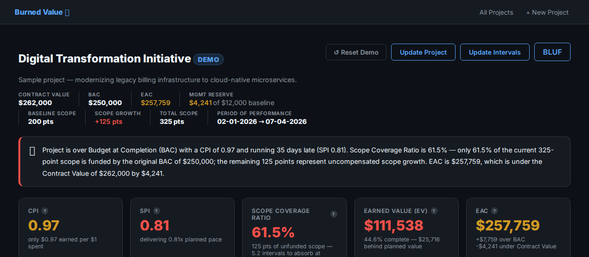
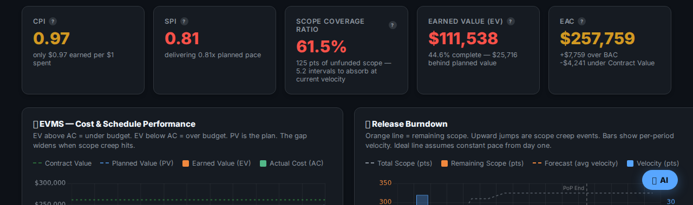
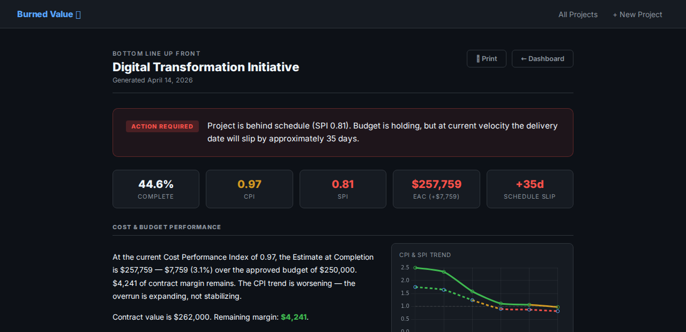
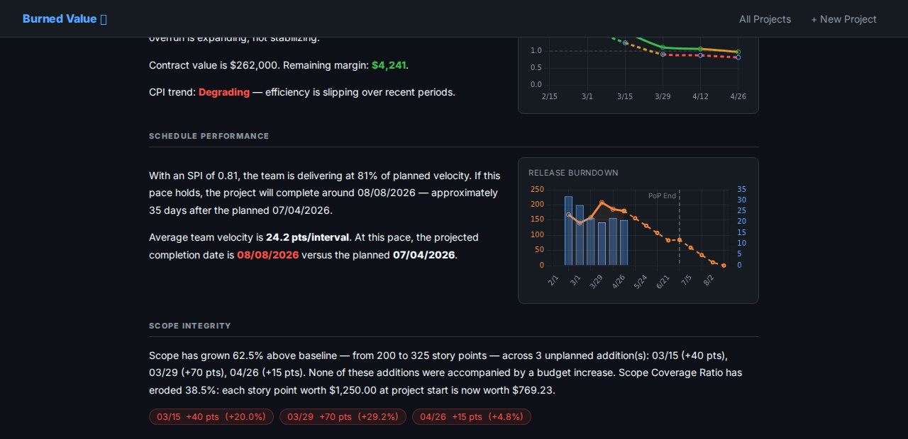

# Burned Value

<p align="center">
  
</p>

<p align="center">
  <em>Dad ran federal programs by the book — rigid waterfall, ironclad baselines, a receipt for everything.<br>
  Mom pioneered Agile — she knew change happens and built the Release Burndown Chart to track it honestly — but never quite got around to tracking the money.<br>
  <strong>Burned Value</strong> inherited Dad's fiscal discipline and Mom's honest accounting of real work. It knows where the money went <em>and</em> what actually got done.</em>
</p>

<p align="center">
  <a href="https://burned-value-demo.uc.r.appspot.com/dashboard/demo"><strong>▶ Live Demo — Digital Transformation Initiative</strong></a>
</p>

---

**Burned Value** is an open-source project governance dashboard that combines EVMS (Earned Value Management System) discipline with Agile Release Burndown transparency. It is built to run entirely within your organization's network with no external dependencies.

---

## Screenshots

<table>
<tr>
<td width="50%"></td>
<td width="50%"></td>
</tr>
<tr>
<td width="50%"></td>
<td width="50%"></td>
</tr>
</table>

---

## Security and Network Profile

Burned Value is designed with IT security in mind. The following applies to all deployments:

**No data leaves your network.**
All project data is stored in a single local JSON file on the host machine. The application makes no outbound connections of any kind unless an AI provider is explicitly configured by the administrator (see AI Integration below).

**No external services, accounts, or registrations required.**
The application has no telemetry, no analytics, no third-party authentication, and no software-as-a-service dependencies. It does not phone home.

**No database server required.**
Burned Value stores all data in a flat file (`data/projects.json`) on the host filesystem. There is no database to patch, license, or secure.

**Minimal attack surface.**
The application is a single Python process (Flask + Gunicorn) serving an internal web UI. It has no public API, no webhook endpoints, and no inbound integration surface.

**Fully air-gapped capable.**
The Docker image can be built and run on a host with no internet access. All dependencies are resolved at build time from `requirements.txt`.

**AI features are optional and off by default.**
The AI analyst feature is disabled (`AI_PROVIDER=none`) unless an administrator explicitly configures an endpoint. When configured for on-premise use with a local Ollama instance, no data ever leaves the internal network. See AI Integration below.

**Open source — no black boxes.**
The full application source is available for review. There are no compiled binaries, no obfuscated code, and no external SDKs that cannot be audited.

---

## How It Works

Burned Value replaces the subjective "percent complete" estimate in traditional EVMS with an objective measure derived from completed Agile story points. This eliminates the most common source of inaccurate project reporting.

### Core Metrics

| Metric | Formula | Meaning |
|---|---|---|
| **Earned Value (EV)** | (Completed Points / Total Scope) × BAC | Objective value delivered in budget dollars |
| **Actual Cost (AC)** | Labor hours × rate + non-labor costs | What was actually spent |
| **Planned Value (PV)** | Linear projection of BAC over the period of performance | What should have been spent by now |
| **CPI** | EV / AC | Cost efficiency — ≥ 1.0 is on or under budget |
| **SPI** | EV / PV | Schedule efficiency — ≥ 1.0 is on or ahead of schedule |
| **EAC** | BAC / CPI | Projected final cost at current performance |
| **Scope Coverage Ratio** | Baseline Scope / Current Scope × 100% | Percentage of current work funded by the original budget |

### Scope Coverage Ratio

When scope is added to a project without a corresponding budget increase, the original budget must cover more work. The Scope Coverage Ratio makes this dilution visible immediately:

- **100%** — scope is unchanged; all work is funded.
- **< 100%** — scope has grown without additional funding. The gap represents uncompensated work that will mathematically result in a cost overrun, a schedule slip, or both.

This replaces optimistic assumptions with a quantifiable early warning.

---

## Deployment

### Docker (Recommended for On-Premise)

**Requirements:** Docker Engine 20+ and Docker Compose V2.

```bash
git clone https://github.com/matthewnewell/BurnedValue.git
cd BurnedValue
docker compose up -d
```

Visit `http://localhost:8080` (or your host's IP on port 8080).

Project data persists in `./data/projects.json` on the host machine and survives container restarts and upgrades.

**To update:**
```bash
git pull && docker compose up -d --build
```

**To expose on your internal network** (behind your firewall):
```yaml
# In docker-compose.yml, change:
ports:
  - "0.0.0.0:8080:8080"
```
```bash
docker compose up -d
```

For production internal deployments, placing Nginx or another reverse proxy in front of the container is recommended.

### Local Development

```bash
cp .env.example .env
pip install -r requirements.txt
python app.py
# Visit http://localhost:8080
```

---

## Configuration

### Environment Variables

| Variable | Description | Default |
|---|---|---|
| `SECRET_KEY` | Flask session signing key — set a unique value in production | `dev-secret-...` |
| `DATA_DIR` | Directory where `projects.json` is written | `./data` |
| `AI_PROVIDER` | `claude` \| `ollama` \| `none` | `none` |
| `AI_API_KEY` | Anthropic API key (only if `AI_PROVIDER=claude`) | — |
| `AI_BASE_URL` | Ollama server URL (only if `AI_PROVIDER=ollama`) | `http://localhost:11434` |
| `AI_MODEL` | Model name to use | `claude-opus-4-5` / `llama3` |

Set variables in `docker-compose.yml` for Docker deployments, or in `.env` for local development.

---

## AI Integration

The AI analyst feature is **disabled by default**. All core earned value and burndown features operate without it.

When AI is enabled, the assistant has read-only visibility into the current project's metrics and answers questions in the context of those numbers. It cannot write data.

### Option A — No AI (default)

```yaml
environment:
  AI_PROVIDER: "none"
```

No outbound connections. No configuration required. Recommended for environments with strict egress controls.

### Option B — On-Premise AI with Ollama

Run a local LLM on your own infrastructure. No data leaves your network.

```yaml
environment:
  AI_PROVIDER: "ollama"
  AI_BASE_URL: "http://your-ollama-host:11434"
  AI_MODEL: "llama3"
```

[Ollama](https://ollama.com) is an open-source tool for running large language models locally on standard server hardware. Supported models include Llama 3, Mistral, and others.

### Option C — Anthropic Claude (Cloud)

For organizations that have approved Anthropic's API for use:

```yaml
environment:
  AI_PROVIDER: "claude"
  AI_MODEL: "claude-opus-4-5"
  AI_API_KEY: "sk-ant-..."
```

With this option, project metrics (not raw data files) are transmitted to Anthropic's API per their [data usage policy](https://www.anthropic.com/legal/privacy).

---

## Production Checklist

Before deploying internally:

- [ ] Set a unique `SECRET_KEY` in `docker-compose.yml`
- [ ] Confirm `AI_PROVIDER` is set to `none` or a reviewed/approved endpoint
- [ ] Place behind a reverse proxy (Nginx, Traefik, or your organization's standard) if exposing beyond localhost
- [ ] Restrict access to the data directory (`./data/`) on the host filesystem
- [ ] Review `requirements.txt` against your organization's approved package list

---

## License

MIT License. Free to use, modify, and deploy within your organization.
